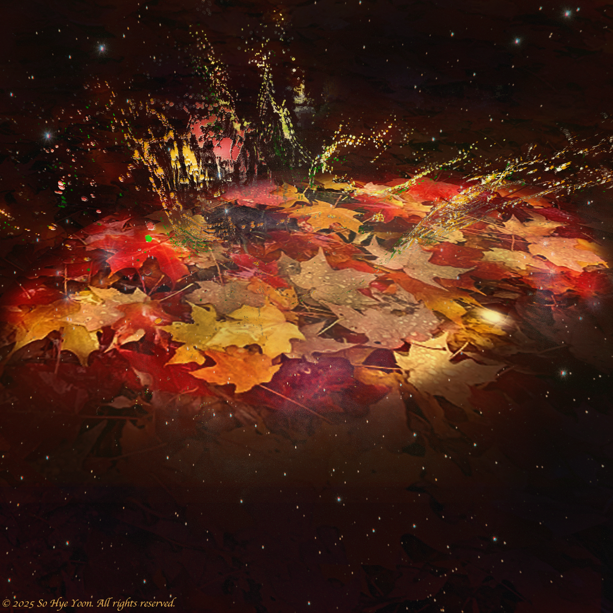
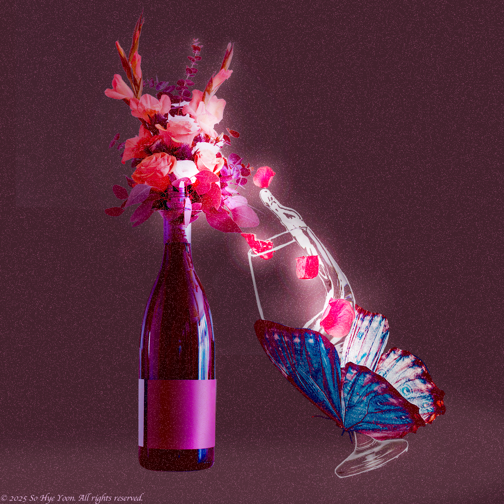

---
layout: page
permalink: /digital_art/
I enjoy creating digital art in my spare time, focusing on minimalist compositions and portrait work.  
Below are a few selected pieces.

 

<figure style="display:inline-block; margin:0.5em;">
  
</figure>

<figure style="display:inline-block; margin:0.5em;">
  
</figure>

<figure style="display:inline-block; margin:0.5em;">
  
</figure>

<figure style="display:inline-block; margin:0.5em;">
  
</figure>

<figure style="display:inline-block; margin:0.5em;">
  
</figure>

<figure style="display:inline-block; margin:0.5em;">
  
</figure>

 
